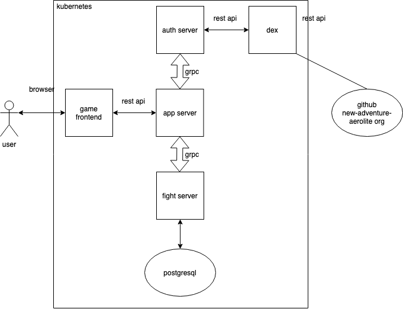

# auth-server

Auth server is a client-app-auth-server in openID connect process, it handles login request from the user, redirects the user to identify provider and return a idToken to users.

Each time user send a request to app-server with the idToken, auth-server will help verify the idToken and extract necessary informations like `email`, `groups`.

BTW, in the `/callback` handler, auth server doesn't return the idToken directly, instead it returns a passcode, and user could use the passcode to fetch the idToken in the endpoint `/passcide`, the passcode will be expired in 5 minutes and could only be used once. As a result, we could let cli in terminate get idToken easily as well.

## Overview



## Installation

```sh
$ git clone https://github.com/new-adventure-aerolite/grpc-auth-server.git

$ cd grpc-auth-server

$ go mod tidy && go mod vendor

$ go build -o auth-server ./main.go
```

help info:
```
$ ./auth-server -h
client side to login with openID

Usage:
  openid [flags]

Flags:
      --client-id string        OAuth2 client ID of this application. (default "example-app")
      --client-secret string    OAuth2 client secret of this application. (default "ZXhhbXBsZS1hcHAtc2VjcmV0")
      --grpc-port string        listen grpc port (default "6666")
  -h, --help                    help for openid
      --issuer string           URL of the OpenID Connect issuer. (default "http://127.0.0.1:5556/dex")
      --issuer-root-ca string   Root certificate authorities for the issuer. Defaults to host certs.
      --port string             listen port (default "5555")
      --redirect-uri string     Callback URL for OAuth2 responses. (default "http://127.0.0.1:5555/callback")
      --tls-cert string         X509 cert file to present when serving HTTPS.
      --tls-key string          Private key for the HTTPS cert.
```

## LICENSE

[MIT](./LICENSE)
